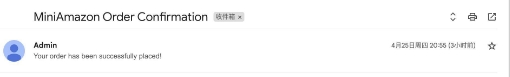
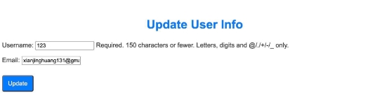
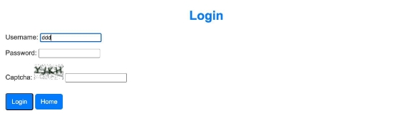
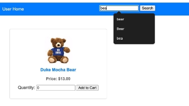
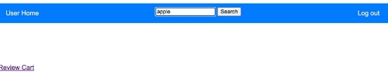
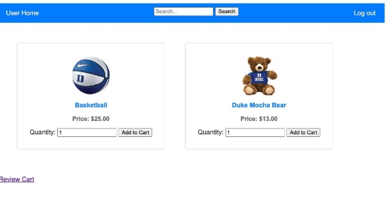
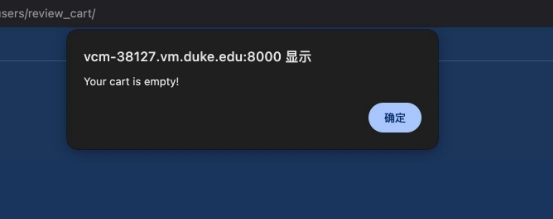
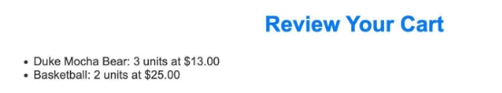
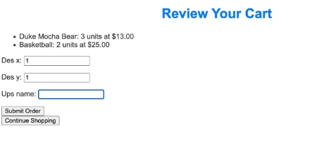
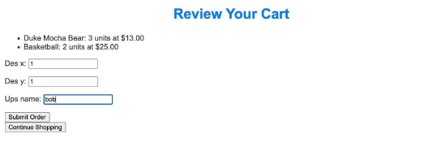

# Mini_Amazon

1. **Confirmation Email**

When the user buy products at our website, he/she will receive an email when the order is placed.

2. **User Info update**

When user logs in, he/she can revise the info, like user name and email.

3. **Login captcha**

When users log in, we ask them to enter captcha for safety.

4. **Searching bar**

We support users to search for products, and it supports key word searching.

When I searching product not in my warehouse, it shows nothing.

5. **Shopping Cart**

Users can add products into cart, and place order together.

When shopping cart is empty, it will pop window shows that: Your cart is empty!

And user can check their shopping cart.

6. **Optional fill in upsUsername**

Users can fill in their Ups name if they have ups account or keep it blank.

7. **When user change destination on ups, our view-order page can show the change of their destination.**
8. **When a product is out of stock, we can show the product is out of stock, and inform world to purchase more.**
9. **We can display the order status of all users' orders, not just one order’s status.**
